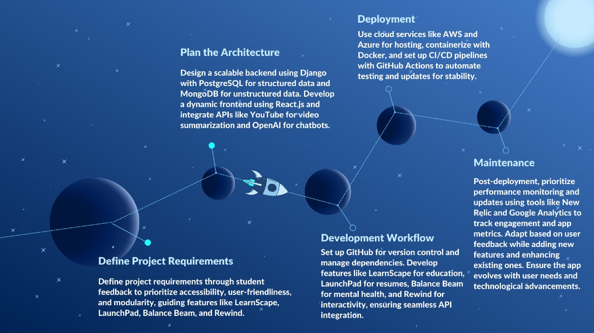
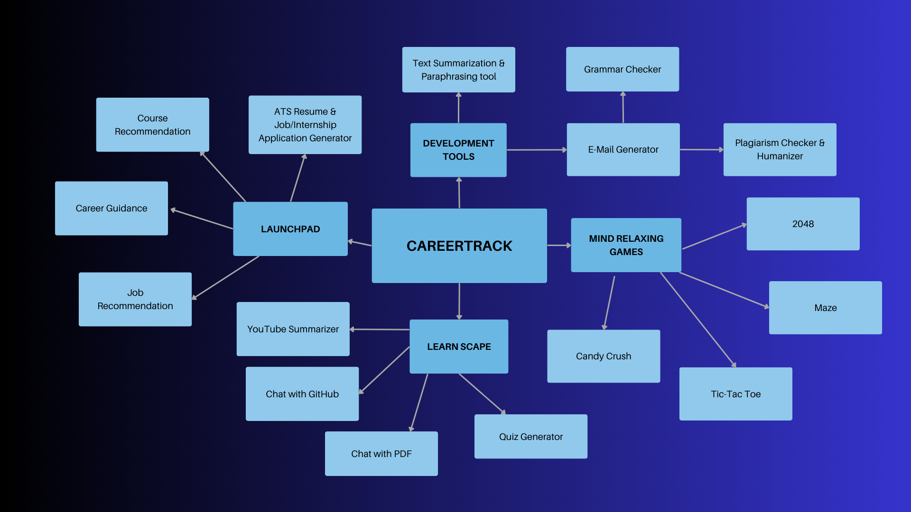

#  🌟CareerTrack: Empowering Students to Learn, Thrive, and Build a Sustainable Future 


**CareerTrack** is a holistic platform tailored for college students, particularly those pursuing computer science and related fields, to excel academically, professionally, and personally. By integrating advanced technologies and thoughtfully designed features, CareerTrack provides a one-stop solution that supports learning 📚, career development 💼, mental well-being 🧠, and relaxation 🎮.

The platform's core mission aligns with the United Nations' Sustainable Development Goals (SDGs) 🌍 by fostering quality education, promoting mental health, and ensuring equal opportunities for professional growth. CareerTrack is divided into four pivotal sections, each addressing critical aspects of student life:

🚀*LearnScape*: Offers high-quality educational tools such as GATE question quizzes, research paper analysis aids, GitHub repository learning modules, and YouTube summarizers with mind maps for efficient learning and revision.
<br><br>
🧑‍💻*LaunchPad*: Enhances employability through features like ATS-powered resume optimization, career recommendations, and roadmaps, enabling students to navigate their professional journey effectively.
<br><br>
🧘*Balance Beam*: Supports students' mental health and emotional well-being with a chatbot and health-related resources, ensuring a balanced and stress-free lifestyle.
<br><br>
🎉*Rewind*: Provides an avenue for relaxation with interactive games, music playlists, and fun activities to recharge and foster creativity.
<br><br>
CareerTrack is more than a student support platform—it is a catalyst for sustainable growth and empowerment. By aligning its mission with the SDGs 🌏, CareerTrack equips students with the resources to thrive in academics 📘, careers 💼, and life 🌟, contributing to a more equitable and sustainable world.


---

## Workflow Diagram




---

## Concept Map



---

## Tech Stack

- **Frontend:**  
  - Next.js (for dynamic UI)
  - React JS (for game development)
  - Tailwind CSS & Accertinity UI (for webpage styling)
  - Particle JS & Three JS (for web graphics)
  
- **Backend:**  
  - Node.js (for backend services)
  - Express.js (for handling API requests)
  - MongoDB (for storing user data, preferences, etc.)
  
- **Gen AI & Machine Learning:**  
  - LangChain (enables interactive applications through real-time communication with language models)
  - LangGraph (orchestration framework for controllable agentic workflows)
  - PhiData (used to build, ship and monitor agentic systems)
  - Hugging Face Transformers (Supports fine-tuning and customization of generative text models)
  
- **Cloud:**  
  - GroqCloud (Utilized for large-scale model inference and powering)

---

## Novelty

The **CareerTrack** project offers a comprehensive and integrated system that addresses multiple facets of a student's life:

- **Holistic Integration of Resources:** CareerTrack combines academic learning, career preparation, mental well-being, and leisure activities into a single cohesive platform. This comprehensive approach eliminates the need for students to juggle multiple tools, saving time and effort while addressing the interconnected aspects of their academic and personal lives.
  
- **Alignment with Sustainable Development Goals (SDGs):** By aligning with the United Nations' Sustainable Development Goals, particularly those focused on quality education, mental well-being, and decent work, CareerTrack ensures its impact goes beyond individual users to support broader societal progress. This alignment makes CareerTrack purpose-driven, linking individual growth to sustainable global development.
  
- **AI-Powered Personalization:** CareerTrack leverages cutting-edge AI and machine learning technologies to deliver highly personalized experiences. From tailored course and career recommendations to job opportunities and mental health support, the platform adapts to each student's unique goals and challenges, providing a truly customized journey.
  
- **Gamified Relaxation for Mental Balance:** CareerTrack recognizes the importance of downtime and creative exploration in a student’s life. By offering features like interactive games and curated music playlists, the platform ensures students can recharge effectively while fostering their problem-solving skills and creativity through enjoyable, stress-relieving activities.
  
- **Tools for Research and Technical Learning:** CareerTrack empowers students with innovative tools such as GitHub repository learning aids, YouTube summarizers with mind maps, and a research bot that simplifies academic research. These features provide a hands-on approach to technical learning and research, making complex tasks more accessible and engaging for students.

---

## Solution

CareerTrack is designed to address the multifaceted needs of modern college students, especially those in computer science and related fields, by offering a comprehensive, all-in-one platform that integrates education, career development, mental health support, and relaxation. The solution aims to empower students to excel academically, professionally, and personally, ensuring that they are well-prepared for the challenges of the future.


### 1. **LearnScape (Learning Materials)**
- Access to **GATE** PYQ questions and topic-based quizzes with real-time result analysis.
- **ResearchBot**  helps students easily understand and analyze research papers.
- **GitHubRepo Chat** for coding beginners to understand repository structures.
- **YouTube Video Summarizer** that extracts key information and generates mind maps for last-minute revisions.

### 2. **LaunchPad (Career Development)**
- **ATS Resume Tracker** that provides resume suggestions and generates job-specific cover letters.
- **Course Recommendation** suggests courses based on career goals, aligning education with future opportunities.
- **Job Recommendation** suggests jobs based on skills and preferences, aligning career opportunities with individual strengths.
- Personalized **Career Roadmaps** for future growth.

### 3. **Balance Beam (Mental Health)**
- **Mental Health Chatbot** for emotional support and guidance.
- Other health-related features to maintain student well-being.

### 4. **Rewind (Leisure & Breaks)**
- Fun games: **2048**, **Candy Crush**, **Maze Runner**, **Tic Tac Toe**.
- Personalized **Music Playlist** for relaxation.

---


## Installation & Setup

To get started with **CareerTrack**, follow these steps:

1. Clone the repository:
  ```bash
   git clone https://github.com/Harshmriduhash/CareerTracker.git
   ```

3. Install the dependencies for frontend and backend:
```bash
cd FullStack
npm install
npm run dev
```
3. Access the app at http://localhost:3000.


